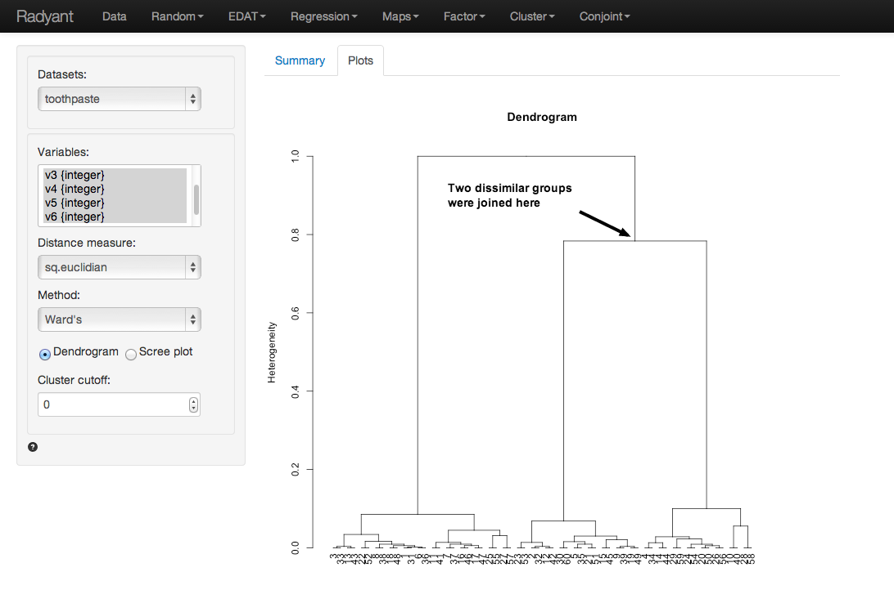
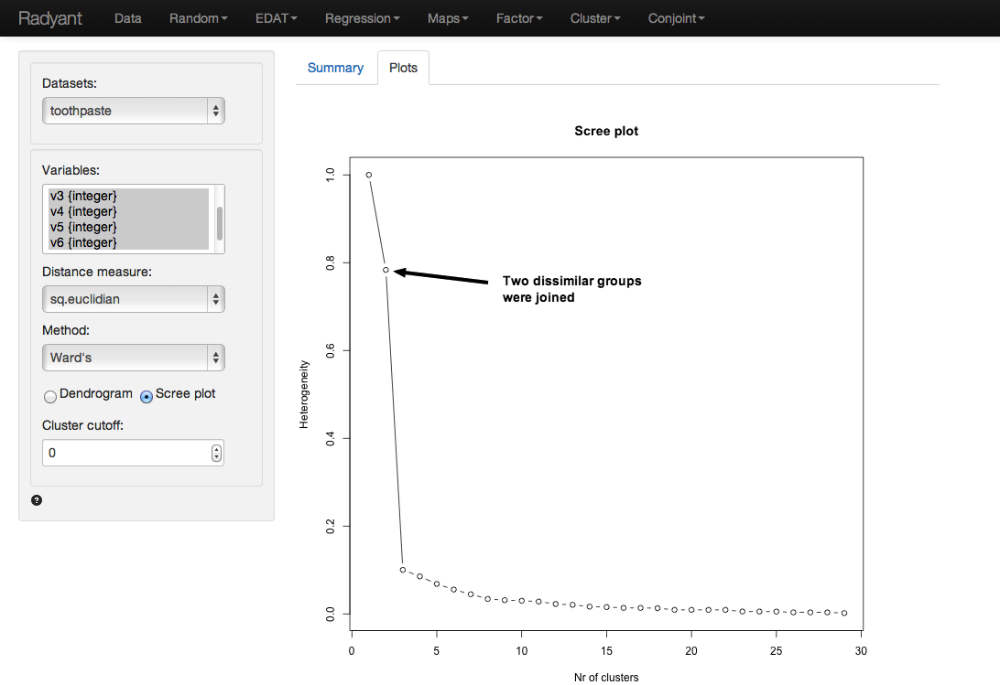

The goal of Cluster Analysis is to group respondents (e.g, consumers) into segments based on needs, benefits, and/or behavior. The tool tries to achieve this goal by looking for respondents that are similar, putting them together in a cluster or segment, and separating them from other, dissimilar, respondents. The researcher will then compare the segments and provide a descriptive label for each (i.e., a name).

# Example: Toothpaste

Click the 'examples' radio button on the Data > Manage page and click 'Load examples' then choose the toothpaste  data from the Datasets dropdown. The data set contains information from 60 consumers who were asked to respond to six questions to determine their attitudes towards toothpaste. The scores shown for variables v1-v6 indicate the level of agreement with the statement indicated on a 7-point scale where 1 = strongly disagree and 7 = strongly agree.

We first need to establish the number of clusters in the data. An appropriate method for this purpose is Hierarchical Cluster Analysis. In marketing, Ward’s method of Hierarchical clustering is generally most appropriate, using the Squared Euclidian distance metric to determine how far or close two individuals are in attribute space. These are the default values in Radiant but they can be changed if desired. The Summary tab produced little information for this analysis so we will focus on the output provided in the Plots tab.

Select variables v1 through v6 in the Variables box. The Dendrogram shown below will allow you to determine the most appropriate number of clusters. 

Hierarchical cluster analysis starts with many segments, as many as there are respondents, and in stepwise (i.e., hierarchical) process adds the most similar respondents or groups together until only one segment is left. To determine the appropriate number of segments look for a 'jump' along the vertical axis of the Dendrogram. At that point two dissimilar segments have been joined. The measure along the vertical axis indicates of the level of heterogeneity within segments that have been formed. The purpose of clustering is to create homogeneous groups of individuals so we want to avoid creating a heterogeneous segment. Since the 'jump' in heterogeneity occurs when we go from 3 to 2 segments we choose 3 segments (i.e., we avoid creating a heterogeneous segment).

Another plots that can be useful to determine the number of segments to create is a scree-plot. This is a plot of the within segment heterogeneity against the number of segments. Again, Hierarchical cluster analysis starts with many segments and groups respondents together until only one segments is left. The scree plot is created in the plots tab when the 'Scree plot' radio button is selected.

Reading the plot from right-to-left we see that within segment heterogeneity increases sharply when we move from 3 to 2 segments. To avoid creating a heterogeneous segment we, again, choose 3 segments. Now that we have decided the appropriate number of segments to extract we can use K-means clustering to calculate the final cluster solution.

&copy; Vincent Nijs (2014) 
